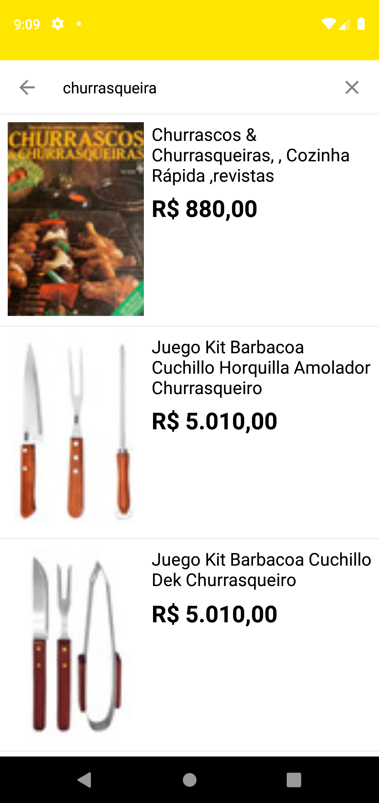
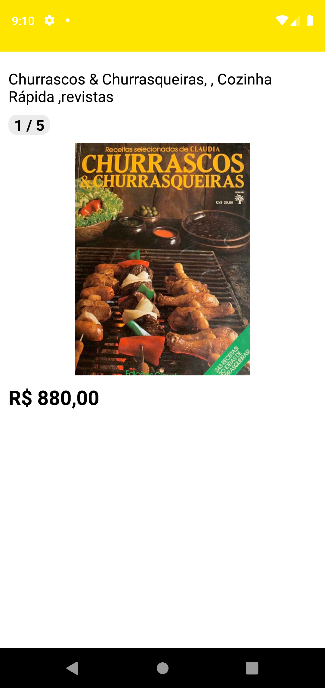

# Meli Searchable

Teste prático para desenvolver aplicativo utilizando API do Mercado Libre.

## Primeiros passo
Adicionar as dependências ao seu arquivo gradle módule.
```sh
    // test
    testImplementation 'junit:junit:4.+'
    androidTestImplementation 'androidx.test.ext:junit:1.1.2'
    androidTestImplementation 'androidx.test.espresso:espresso-core:3.1.0'
    androidTestImplementation 'androidx.test:runner:1.1.0'
    androidTestImplementation 'androidx.test:rules:1.1.0'
    testImplementation "org.mockito:mockito-core:2.15.0"
    androidTestImplementation 'com.android.support.test:runner:1.0.1'
    androidTestUtil 'com.android.support.test:orchestrator:1.0.1'

    // searchview
    implementation 'com.miguelcatalan:materialsearchview:1.4.0'

    // retrofit
    implementation 'com.squareup.retrofit2:retrofit:2.9.0'
    implementation 'com.squareup.retrofit2:converter-gson:2.9.0'

    // glide
    implementation 'com.github.bumptech.glide:glide:4.12.0'
    annotationProcessor 'com.github.bumptech.glide:compiler:4.12.0'
```

## API REST Utilizadas

Lista todos o produtos. 
- Parâmetro necessário: `q`.

Exemplo:
```sh
https://api.mercadolibre.com/sites/MLA/search?q=Motorola
```

Exibe o detalhe do produto. 
- Parâmetro necessário: `ids`.

Exemplo:
```sh
https://api.mercadolibre.com/items?ids=MLA599260060
```

Fonte: [API para desenvolvedores](https://developers.mercadolibre.com.ar/es_ar/items-y-busquedas#Obtener-items-de-los-listados-por-vendedor)

### Teste Espresso

Configuração do ambiente de teste.
Para evitar instabilidades, é altamente recomendável que você desative as animações do sistema nos dispositivos virtuais ou físicos usados para testes. No dispositivo, em Config. > Opções do desenvolvedor, desative estas três configurações:

> Escala de animação da janela; 
> 
> Escala de animação de transição;
>  
> Escala de duração do Animator; 

Fonte: [Instruções de configuração do Espresso](https://developer.android.com/training/testing/espresso/setup


### Telas do Aplicativo

Campo de busca:
<p align="center">
  
</p>

Resultado da busca:
<p align="center">
  
</p>

Detalhe do produto:
<p align="center">
  
</p>


## License

MIT

**Free Software!**
